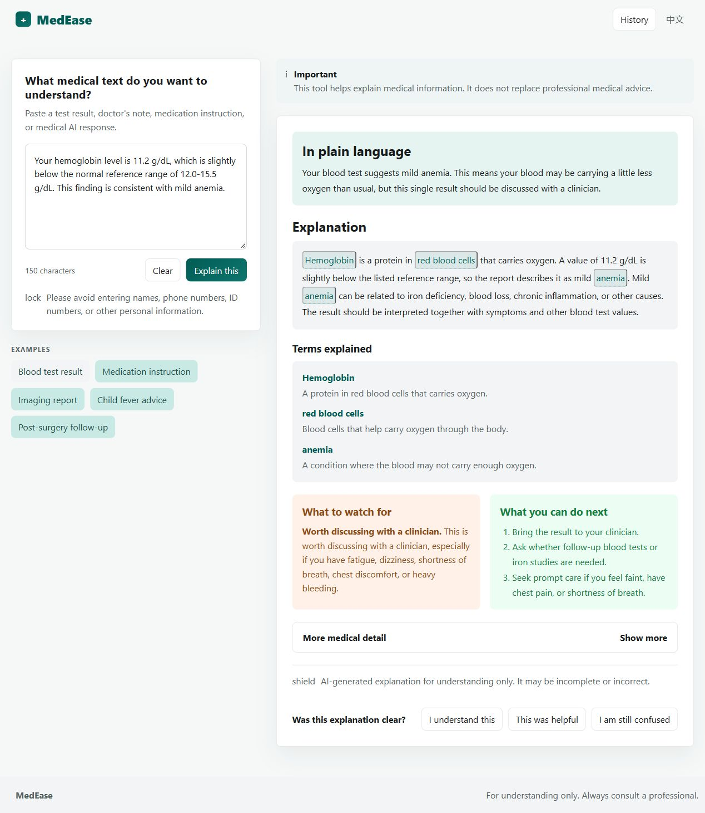
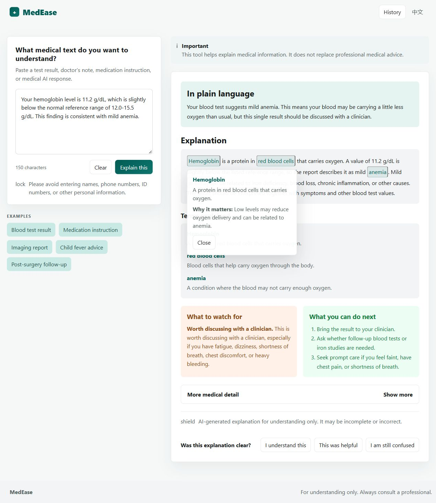

<a id="readme-top"></a>

<div align="center">

# MedEase

<p><strong>AI Medical Advice Comprehensibility</strong></p>

Helping non-expert users understand AI-mediated medical advice through cognitive-load-aware explanations.

[](LICENSE)
[](#about-the-project)
[](#research-results)

[Explore the docs](docs/project_overview.md) · [Try the demo](#getting-started) · [Report an issue](https://github.com/xuzihao723/ai-medical-advice-comprehensibility/issues)

</div>



*Interface preview using a built-in demonstration case; this is not a live model response.*

<details>
<summary>Table of contents</summary>

- [About the project](#about-the-project)
- [Features](#features)
- [Built with](#built-with)
- [Getting started](#getting-started)
- [Usage](#usage)
- [Research results](#research-results)
- [Reproduce the sample classifier](#reproduce-the-sample-classifier)
- [Repository structure](#repository-structure)
- [Documentation](#documentation)
- [Limitations and responsible use](#limitations-and-responsible-use)
- [Contributing](#contributing)
- [License](#license)
- [Citation and contact](#citation-and-contact)
- [Acknowledgments](#acknowledgments)

</details>

## About the project

Medical explanations can be fluent yet difficult to understand. Dense terminology, numerical findings, and multiple instructions can make it harder for non-expert readers to identify the main message and follow-up actions.

**MedEase is an HCI research prototype that connects text complexity analysis, cognitive-load estimation, and adaptive presentation.** It explores whether changing how an explanation is presented can improve comprehension and reduce workload.

In API mode, the backend generates a structured explanation through an OpenAI-compatible provider, classifies the English explanation content as `low`, `medium`, or `high` cognitive load, and selects interface actions. The frontend then presents summaries, terminology explanations, risk cues, and expandable technical details.

The deployed classifier uses **TF-IDF + Logistic Regression**. Heuristic indicators of readability, terminology density, sentence length, and information density are reported separately; they are not the deployed model's input features. UI actions also consider risk level, explanation length, and term count. See the [methodology](docs/methodology.md) and [runtime policy](backend/app/services/ui_policy_service.py).

> **Research scope:** MedEase supports understanding of medical text. It does not diagnose disease, verify clinical correctness, or replace professional medical judgment.

## Features

- **Adaptive explanations:** plain-language summaries, inline term definitions, risk emphasis, and collapsible technical details.
- **Cognitive-load estimation:** three-class text classification with a bundled research model.
- **Bilingual presentation:** English-first content with a Chinese display toggle.
- **Static frontend:** built-in examples work without a backend or API key; no npm installation is required.
- **Session tools:** browser-local history, session details, deletion, and JSON export.
- **Research artifacts:** classifier metrics, baseline comparisons, study summaries, and a lightweight sample training workflow.

<details>
<summary>Preview an inline term explanation</summary>



*Captured from the built-in blood-test example.*

</details>

## Built with

| Component | Technologies |
| --- | --- |
| Interface | HTML, CSS, vanilla JavaScript, browser `localStorage` |
| Backend | Python, FastAPI, Uvicorn, Pydantic |
| Explanation generation | OpenAI Python SDK with an OpenAI-compatible provider |
| Classification | scikit-learn, TF-IDF, Logistic Regression, joblib |
| Data and analysis | pandas, NumPy; exported JSON, CSV, Markdown, and SVG artifacts |

Dependencies are listed in [requirements.txt](requirements.txt) and [backend/requirements-backend.txt](backend/requirements-backend.txt).

## Getting started

### 1. Get the project

You need Git and a modern browser. Python 3.11 is recommended for the backend and sample classifier.

```sh
git clone https://github.com/xuzihao723/ai-medical-advice-comprehensibility.git
cd ai-medical-advice-comprehensibility
```

### 2. Preview the interface without an API key

Open `frontend/index.html` in your browser and select a built-in example, such as **Blood test result** or **Imaging report**. Selecting an example displays a prepared explanation immediately.

To serve the interface over HTTP instead, run this command from the repository root:

```sh
python -m http.server 8080 --bind 127.0.0.1 --directory frontend
```

Then open [http://127.0.0.1:8080](http://127.0.0.1:8080).

The checked-in frontend uses API mode for the **Explain this** button. Generating an explanation for your own input requires the backend below. For a fully mocked interface, change the existing assignment in `frontend/index.html` to `window.MEDEASE_API_MODE = "mock"`; mock outputs are demonstrations.

### 3. Install backend and classifier dependencies

Run these commands from the repository root in **Windows PowerShell**:

```powershell
python -m venv .venv
.\.venv\Scripts\python.exe -m pip install -r requirements.txt
```

The commands below call the virtual environment's Python directly, so activation is optional.

### 4. Configure and start the backend

Create a local configuration file from the provided template:

```powershell
Copy-Item backend/.env.example backend/.env
```

Edit `backend/.env` with an API key and model names supported by your chosen OpenAI-compatible provider:

```dotenv
CLOSEAI_API_KEY=<your-provider-api-key>
CLOSEAI_BASE_URL=https://api.openai-proxy.org/v1
CLOSEAI_MODEL=gpt-4.1-mini
CLOSEAI_FALLBACK_MODEL=gpt-4o-mini
MEDEASE_LOGGING_ENABLED=false
```

The URL and model names above match [backend/.env.example](backend/.env.example); replace them to match your provider. The template enables logging by default; the example above disables it for local exploration. Keep credentials out of the frontend and version control.

Start the service from the repository root:

```powershell
.\.venv\Scripts\python.exe -m uvicorn app.main:app --host 127.0.0.1 --port 8000 --app-dir backend
```

The backend reads `backend/.env` at startup. Existing process environment variables take precedence; restart the service after changing configuration.

<details>
<summary>macOS / Linux equivalents</summary>

```sh
python3 -m venv .venv
.venv/bin/python -m pip install -r requirements.txt

cp backend/.env.example backend/.env
# Edit backend/.env with your provider settings before starting the service.

.venv/bin/python -m uvicorn app.main:app --host 127.0.0.1 --port 8000 --app-dir backend
```

For classifier commands, use `.venv/bin/python` in place of `.\.venv\Scripts\python.exe`.

</details>

### 5. Check the local service

Open [the health endpoint](http://127.0.0.1:8000/api/health) or run this in another PowerShell window:

```powershell
Invoke-RestMethod -Uri "http://127.0.0.1:8000/api/health"
```

- `ready` indicates that an API key is configured; it does not verify provider authentication or model availability.
- `complexity_model_ready` indicates that the bundled classifier loaded successfully.

API schemas and interactive documentation are available at [http://127.0.0.1:8000/docs](http://127.0.0.1:8000/docs). The frontend's default explanation endpoint is `http://127.0.0.1:8000/api/explain`.

## Usage

1. Select an example, or paste anonymized medical text into the input area.
2. For custom input in API mode, click **Explain this** after starting the backend.
3. Read the summary, select highlighted terms for definitions, and expand **More medical detail** when needed.
4. Switch the display language or review saved sessions through **History**.

The API accepts `POST /api/explain` with this request structure:

```json
{
  "input_text": "The ECG shows sinus tachycardia. This means the heart is beating faster than usual and should be interpreted with symptoms.",
  "language": "en",
  "translate_to_zh": true,
  "save_session": false
}
```

Responses include explanation content, terminology, `cognitive_load_label`, `semantic_complexity_features`, and `ui_actions`. Check `fallback_type`: an HTTP response may contain an `api_error`, `insufficient_info`, or `non_medical` fallback instead of a generated explanation.

For interface routes and configuration, see the [frontend guide](frontend/README.md). For service details, see the [backend guide](backend/README.md).

## Research results

### Cognitive-load classification

The repository reports the following results for the deployed **TF-IDF + Logistic Regression** classifier on the manually labeled evaluation set:

| Metric | Reported value |
| --- | ---: |
| Evaluation scope | `manual_eval` |
| Evaluation samples | 320 |
| Accuracy | 0.828125 |
| Macro-F1 | 0.800466 |

Sources: [metrics](results/metrics.json), [training report](results/model_training_report.md), and [baseline leaderboard](results/baseline_leaderboard.md). Some transformer baselines achieved higher offline scores; the deployed model was selected for interpretability and lightweight integration. Compare only leaderboard rows with `eval_samples=320` and `comparable_eval320=yes`.

### Within-subject interface study

The repository reports paired observations from **30 participants**, comparing a conventional display (A) with the adaptive explanation interface (B):

| Measure | Conventional display (A) | Adaptive interface (B) |
| --- | ---: | ---: |
| Comprehension accuracy | 76.00% | 88.45% |
| NASA-TLX workload | 70.306 | 48.945 |
| Task completion time | 293.967 s | 257.233 s |

Sources: [study design](docs/ab_study_design.md), [study summary](results/study_summary.json), and [analysis report](results/study_analysis_report.md).

These are archived research results, not outcomes reproduced by the public sample workflow. The full training data, manual labels, and participant-level study data are not included. The study concerns comprehension and workload; it does not establish clinical effectiveness.

## Reproduce the sample classifier

After installing `requirements.txt`, run these commands from the repository root:

```powershell
.\.venv\Scripts\python.exe src/train_classifier.py --input data/sample_anonymized_data.csv --out results/sample_model.joblib
.\.venv\Scripts\python.exe src/evaluate.py --input data/sample_anonymized_data.csv --model results/sample_model.joblib --out results/sample_metrics.json
```

This trains a small classifier and writes a [sample metrics file](results/sample_metrics.json). The CSV contains **8 anonymized demonstration samples** with `sample_id`, `text`, and `label` columns.

**This example evaluates on the same samples used for training.** Its scores show that the pipeline runs, not how well it generalizes. It does not reproduce the `manual_eval` research results. It writes a separate sample model and does not replace the backend's bundled classifier in `models/cognitive_load_classifier.joblib`.

## Repository structure

```text
ai-medical-advice-comprehensibility/
├── backend/         FastAPI service, schemas, and runtime policies
├── config/          Research UI policy configuration
├── data/            Small anonymized demonstration dataset
├── demo/            Interface screenshots
├── docs/            Overview, methodology, study design, and limitations
├── frontend/        Static MedEase interface
├── models/          Bundled research classifier
├── notebooks/       Analysis guide and notebook placeholders
├── paper/           Research abstract
├── results/         Archived metrics, reports, tables, and figures
├── scripts/         Research analysis utilities
├── src/             Lightweight sample training and evaluation scripts
├── LICENSE          MIT license
├── README.md
└── requirements.txt
```

Research utilities in `scripts/` may refer to private inputs or artifacts from the full research workspace. They are not all standalone reproduction entry points for this public package. Use `src/` for the public sample workflow.

## Documentation

| Resource | Contents |
| --- | --- |
| [Project overview](docs/project_overview.md) | Research questions, audience, and system components |
| [Methodology](docs/methodology.md) | Labels, semantic indicators, classifier, and adaptation concept |
| [A/B study design](docs/ab_study_design.md) | Study conditions, measures, and reported outcomes |
| [Limitations and ethics](docs/limitations_ethics.md) | Data restrictions, model limits, and responsible-use scope |
| [Frontend guide](frontend/README.md) | Interface features, routes, and mock/API configuration |
| [Backend guide](backend/README.md) | Service endpoints and research logging |
| [Research abstract](paper/abstract.md) | Summary of the research contribution |
| [Baseline leaderboard](results/baseline_leaderboard.md) | Offline comparisons on the manual evaluation set |

## Limitations and responsible use

- **Clinical scope:** a cognitive-load prediction does not establish the correctness, factuality, or safety of medical advice. Generated explanations may be incomplete or incorrect.
- **Data access:** only a small anonymized demonstration dataset is public; the complete research evaluation cannot be rerun from this package alone.
- **Generalization:** the interface study involved 30 participants. Larger and more diverse studies are needed before drawing broad conclusions.
- **Privacy:** API-mode input is sent to the configured explanation provider. Avoid personal identifiers and confidential medical records when exploring the prototype. Saved sessions are kept in browser `localStorage` and can be deleted through the interface.
- **Logging:** backend trace logging is enabled by default unless disabled through `MEDEASE_LOGGING_ENABLED=false`. It stores hashes, lengths, complexity features, and interface actions rather than raw input by default. Trace logs describe system behavior; they are not direct evidence of user benefit.

See [limitations and ethics](docs/limitations_ethics.md) for the research scope.

## Contributing

To report a problem, [open an issue](https://github.com/xuzihao723/ai-medical-advice-comprehensibility/issues) with reproduction steps, expected behavior, and relevant environment details. Use anonymized examples and omit API keys.

For proposed changes, fork the repository, create a focused branch, and submit a pull request describing the change and how you checked it. Documentation corrections, reproducibility improvements, and accessibility feedback are useful contributions.

## License

Distributed under the **MIT License**. See [LICENSE](LICENSE) for the full terms.

## Citation and contact

If you reference this prototype, use the following suggested citation:

```bibtex
@misc{xu2026medease,
  author = {Xu, Zihao},
  title = {MedEase: From Semantic Complexity to Adaptive Explanation for AI-Mediated Medical Advice Comprehensibility},
  year = {2026},
  howpublished = {\url{https://github.com/xuzihao723/ai-medical-advice-comprehensibility}},
  note = {Research prototype}
}
```

This citation identifies the repository; it does not imply a peer-reviewed publication.

Maintainer: [Zihao Xu (@xuzihao723)](https://github.com/xuzihao723). For project questions, use the [issue tracker](https://github.com/xuzihao723/ai-medical-advice-comprehensibility/issues).

## Acknowledgments

README organization and presentation were informed by [Awesome README](https://github.com/matiassingers/awesome-readme) and [Best-README-Template](https://github.com/othneildrew/Best-README-Template), adapted to this research prototype.

The research methodology describes an OpenMed/MedDialog-based dialogue corpus; see the [methodology notes](docs/methodology.md) for the public data scope.

<p align="right"><a href="#readme-top">Back to top</a></p>
